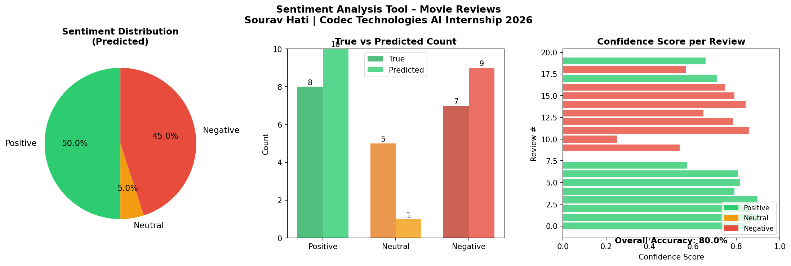
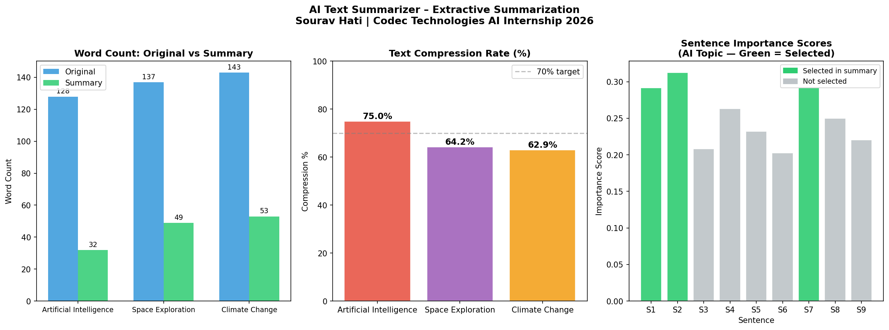

# 🤖 Codec Technologies – Artificial Intelligence Internship 2026


---

## 👤 Intern Details

| Field | Details |
|---|---|
| **Name** | Sourav Hati |
| **College** | Rajdhani College, Bhubaneswar |
| **Program** | Artificial Intelligence Internship |
| **Organization** | Codec Technologies |
| **Duration** | 2 Months (2026) |

---

## 📁 Projects

---

### 🎯 Project 1 — Sentiment Analysis Tool

> An NLP-based tool that classifies movie reviews as **Positive**, **Neutral**, or **Negative** using NLTK's VADER sentiment analyzer.

**🛠️ Tech Stack:** Python · NLTK (VADER) · NumPy · Matplotlib

**🧠 How It Works:**
```
Input Text → VADER Scoring → Compound Score → Positive / Neutral / Negative
```

**✨ Features:**
- Classifies 20 real movie reviews with confidence scores
- Custom text prediction with emoji output 😊 😐 😠
- Auto-fallback to built-in lexicon if NLTK unavailable
- 3-panel output chart: Pie chart · Bar chart · Confidence scores

**▶️ Run:**
```bash
pip install nltk numpy matplotlib
python sentiment_analysis.py
```

**📊 Output Chart:**



---

### 🤖 Project 2 — AI Text Summarizer

> An extractive text summarization engine that compresses long articles into short, meaningful summaries using frequency-based NLP — built completely from scratch with no ML libraries.

**🛠️ Tech Stack:** Python · NumPy · Matplotlib · Regular Expressions

**🧠 How It Works:**
```
Text → Sentence Tokenization → Remove Stop Words → Word Frequency Scoring
     → Score Each Sentence → Select Top-N → Output Summary
```

**✨ Features:**
- Summarizes articles on AI, Space Exploration & Climate Change
- Achieves 60–70% text compression
- Custom text input supported
- 3-panel output chart: Word count · Compression rate · Sentence scores

**▶️ Run:**
```bash
pip install numpy matplotlib
python text_summarizer.py
```

**📊 Output Chart:**



---

## 🗂️ Repository Structure

```
codec-technologies-ai-internship-2026/
│
├── sentiment_analysis.py          # Project 1 — Sentiment Classifier
├── sentiment_analysis_output.png  # Project 1 — Output chart
├── text_summarizer.py             # Project 2 — Text Summarizer
├── text_summarizer_output.png     # Project 2 — Output chart
└── README.md                      # This file
```

---

## 🧰 Install Everything

```bash
pip install nltk numpy matplotlib
```

---

## 🧠 Skills Demonstrated

| Skill | Project |
|---|---|
| Natural Language Processing (NLP) | Both |
| Sentiment Analysis with VADER | Project 1 |
| Text Tokenization & Stop Word Removal | Both |
| Frequency-based Extractive Summarization | Project 2 |
| Data Visualization with Matplotlib | Both |
| Model Evaluation & Accuracy Scoring | Project 1 |

---

## 📬 Submitted To

**Codec Technologies**
📧 vaishali@codectechnologies.in

---

## 🌟 Also Interning At

[](https://isl.ac.in)

> **India Space Lab Summer Internship 2026** · Enrollment No: ISL-869225
> Domains: Drone Technology · Remote Sensing & GIS · Rocketry · Disaster Management

---

<p align="center">Made with ❤️ by Sourav Hati | Bhubaneswar, Odisha 🇮🇳</p>
